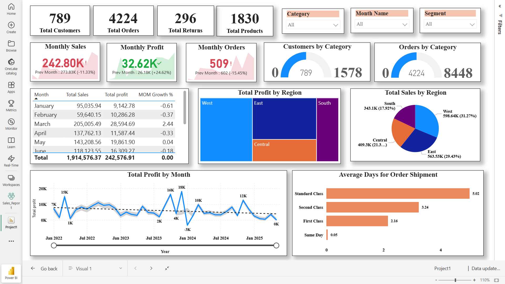

# 📊 Sales Dashboard – Power BI Project

## 📌 Project Overview
This project focuses on analyzing sales performance using **Power BI** with data extracted and transformed in Power Query Editor**.  
The dashboard provides key business insights such as revenue trends, profitability, and monthly comparisons, helping stakeholders make data-driven decisions.

---

## 🛠 Tools & Technologies  
- **Power BI** → Dashboard development, visualizations, and reporting.  
- **DAX** → Custom measures for advanced calculations.  
- **Excel** → Pre-cleaning and validation of data.  

---

## 📊 Key Features & Insights
- **KPI Metrics**: Total Sales, Total Profit, Profit %, and Quantity Sold.  
- **DAX Measures**:  
  - *Previous Month Sales* → `CALCULATE([Total Sales], DATEADD('Date Table'[Date], -1, MONTH))`  
  - *Profit %* → `DIVIDE([Profit], SUM('Sales Data'[Sales1]), 0) * 100`  
- **Data Modeling**: Created a separate **Date Table** and built relationships for accurate time-based analysis.  
- **Feature Engineering**: Added new calculated columns to enrich insights.  
- **Visuals**:  
  - Monthly Sales Trend (Line Chart)  
  - Sales by Region/Category (Pie Chart)  
  - Profitability Analysis (Card visuals)  
  - Year-over-Year Comparison  

---

## 📌 Business Case Study – Summary
The Sales Dashboard enables decision-makers to:  
✔ Identify the most profitable regions, categories, and time periods.  
✔ Monitor **month-over-month sales growth** and detect performance drops.  
✔ Track **Profit % trends** to ensure business sustainability.  
✔ Evaluate sales seasonality and patterns for better forecasting.  

This project demonstrates how **data analytics + visualization** can transform raw transactional data into actionable insights that directly support business strategy.  

---

## 📷 Screenshots

---

## 🚀 Learning & Impact
- Gained hands-on experience in **Data Modeling + DAX**.  
- Strengthened understanding of how a Data Analyst supports business decisions.  
- Built end-to-end project workflow: Data → Transform → Visualize → Insights.  

---

## 📌 How to Use
1. Clone this repository.  
2. Open the `.pbix` file in Power BI Desktop.  
3. Explore the dashboards and modify with your own dataset.  

---

## 🔗 Live Dashboard
[View on Power BI Service](https://app.powerbi.com/view?r=eyJrIjoiZmQ2MTc3MjgtNTA5My00NzJlLWI4MDYtNWQ5YzJhOWU3ZjMzIiwidCI6IjQyYzJjNGE0LTcyMTEtNGEwNC1hNTk4LWEyN2Q1YWIzMjY4MSJ9)

---

# ✅ Conclusion (Case Study)
This project proved how a **Sales Dashboard** can empower businesses with visibility into their operations. From revenue growth tracking to profitability analysis, the dashboard acts as a single source of truth for decision-making.  
For organizations, such insights mean **better planning, optimized resource allocation, and improved sales strategies**.  
For me, this project strengthened my **Data Analyst skills** in Power BI, DAX, and storytelling with data.  

## 📌 Author  
👤 **Akshay Kumar S**  
- Aspiring **Data Analyst** | SQL | Power BI | Python | Excel  
- [LinkedIn Profile](www.linkedin.com/in/akshay-kumar-212002ak)  
- akshaysubramanian064@gmail.com  
